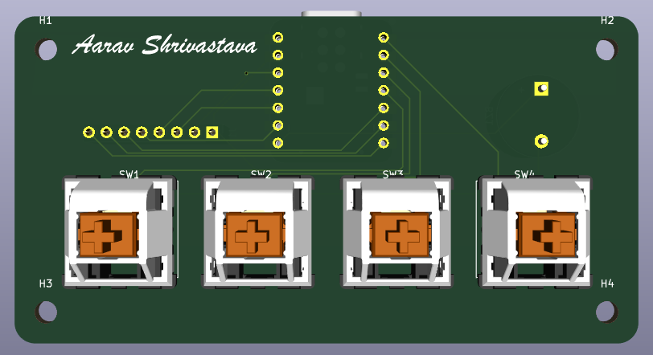
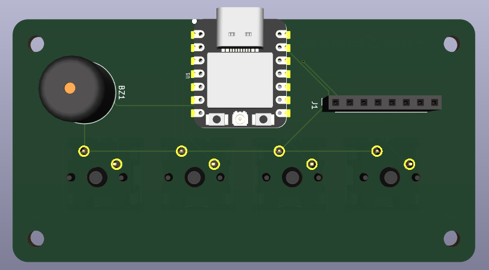
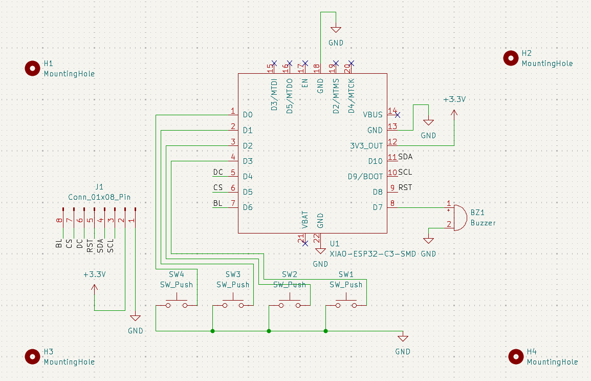
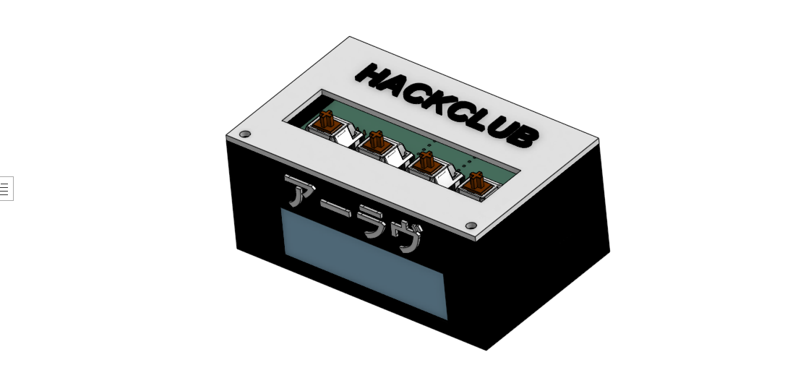

# Alarm Clock

A custom 4-key alarm clock built around the Seeed XIAO ESP32-C3 and a 2.25 inch TFT display.

The idea was to make a small, simple alarm clock with a custom PCB and a 3D printed enclosure instead of putting everything together with loose wires.

---

# The Idea

I wanted to build something that would let me learn the complete hardware design process, from making a schematic and PCB to designing a case around the actual hardware.

For this project, I decided to keep the design simple:

- 4 mechanical keys
- 2.25 inch TFT display
- Seeed XIAO ESP32-C3
- Piezo buzzer
- Custom PCB
- Custom 3D printed enclosure

**The PCB and enclosure are currently completed. Firmware and the physical build will come next.**

**PCB**

 

**Schematic**

**Enclosure**

---

_**DEVEOPMENT IS UNDER PROGRESS. WAITING FOR COMPONENTS APPROVEL xD**_

